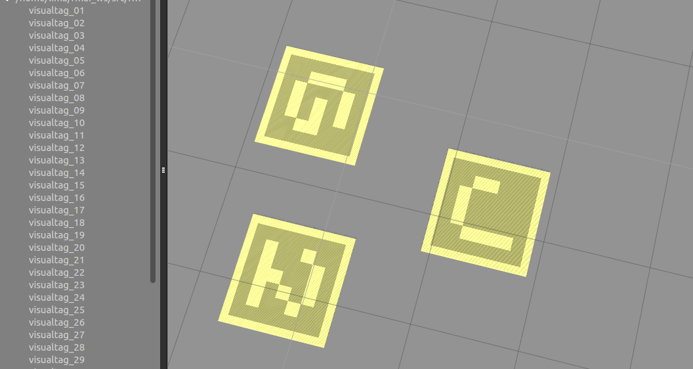

# RoboMaster visualtag gazebo model



Install models:
```bash
cp -R robomaster_visualtag_gazebo/models/* ~/.gazebo/models/
```

Generate tag models:
```bash
# Edit the following lines in generate.py to create tag models you want
# 45:	for i in range(1,44):
# 46:		generator.generate('imgs/', 'visualtag_%02d' % i, tag_size)
```